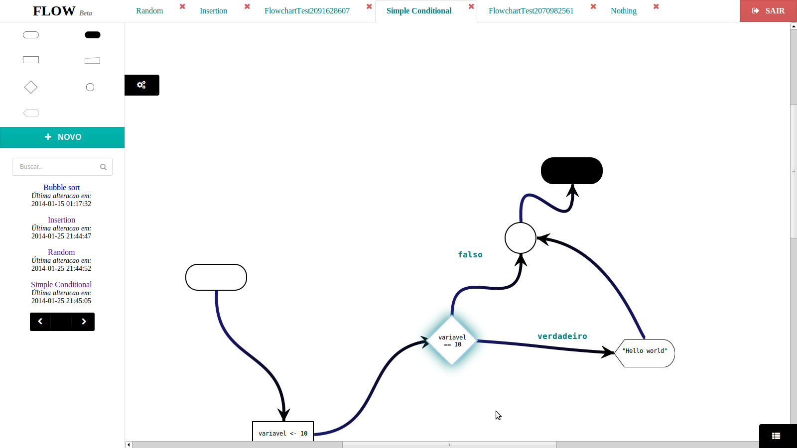

#FLOW

My final graduation work, a web tool that allows the creation of executable flowcharts.

This work was done as a requirement to obtain my graduation degree in System Analysis and Development through the
Federal Technological University of Paraná. The advisor was Adriano Rívolli da Silva, and the work was funded by
the "Programa de Bolsas de Formento às Ações de Graduação".

It uses PostgreSQL as the database system, PLPGSQL for the database code, PHP for the server side code,
CSS for the style and a great amount of JavaScript to allow the creation, interaction and execution of the flowcharts
in a web browser. Also, a multitude of
libraries and frameworks was used in order to leverage existant solutions and speed the development.
Soon I'm going to provide the install instructions.

Below is the abstract of the produced papper and some screenshots of the tool running:

##ABSTRACT
> Algorithms and programming logic are the most important concepts that one person
needs in order to become a good programmer but, although essential, those are not
simple subjects. Among the different methods used in aid to the teaching and
learning of those subjects, flowcharts stand out as the most used due to its good
acceptance among students, what occurs due the fact that flowcharts are a graphical
representation of algorithms. However, the use of flowcharts as a mere graphical
abstraction can be seen as an unnecessary limitation. In this context was proposed
and developed a web tool that allows a user to create flowcharts that can be run
similarly to computer programs. This flowchart execution of the tool can be performed
in a complete mode, in which all the flowchart is traversed from the beginning to the
end and in a step by step mode, in which the user as complete control over the steps
of the flowchart execution. The step by step mode is especially effective to
demonstrate the logical operation of an algorithm. The tool also provides to the user
a high level of freedom in the construction of flowcharts and because the tool has
been developed for web environments, presents several possibilities of future
expansion. The existence of this tool raises the possibility of assisting the teaching
and learning process of algorithms.

> Keywords: Flowcharts. Step by step execution. Algorithms.

***

***

***

***

***